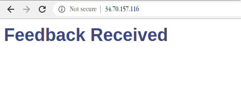
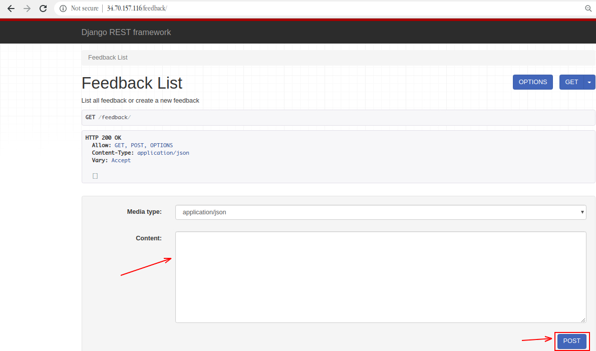
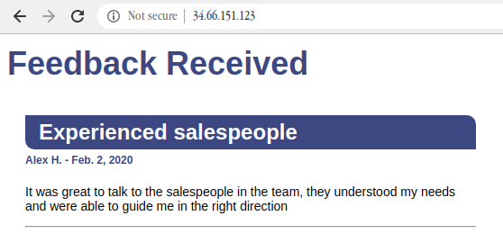
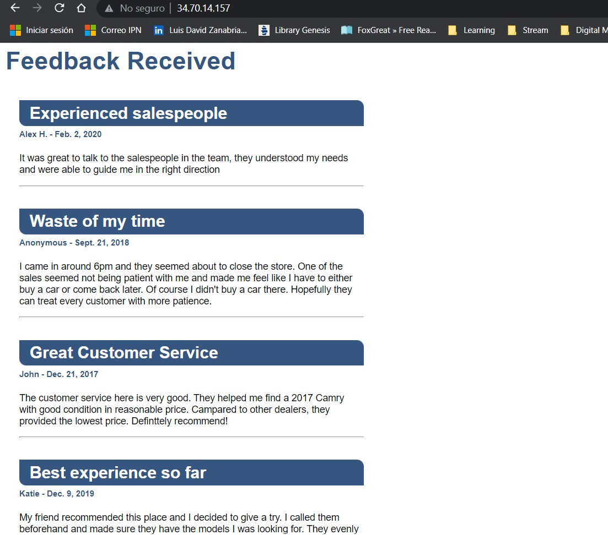

# Project Problem Statement
To complete this module, you'll write a script that interacts with a running web service.  The web service is part of your company's website and is in charge of storing and displaying the customer reviews of the company.

The reviews are stored in text files in the local disk. Your script should open those files, process the information to turn it into the format expected by the web service, then send it to the web service to get stored.

For this lab, the service is running on the same machine, and you can actually look at how all of it is implemented, if you want.  But you don't need to change the service implementation to complete the exercise.

Remember that you can take your time to prepare the code that you’ll write. You can start the lab later on, once you have a good idea of what you'll do and how you'll do it.

Also, feel free to check out the resources that we pointed to as many times as you need.

Good luck, you've got this!

## Introduction
You're working at a company that sells second-hand cars. Your company constantly collects feedback in the form of customer reviews. Your manager asks you to take those reviews (saved as .txt files) and display them on your company's website. To do this, you'll need to write a script to convert those .txt files and process them into Python dictionaries, then upload the data onto your company's website (currently using Django).

What you'll do
- Use the Python OS module to process a directory of text files
- Manage information stored in Python dictionaries
- Use the Python requests module to upload content to a running Web service
- Understand basic operations for Python requests like GET and POST methods

### Web server corpweb
Django is a high-level Python Web framework that encourages rapid development and clean, pragmatic design. A Web framework is a set of components that provide a standard way to develop websites quickly and easily.

For this lab, a Django web server corpweb is already configured under /projects/corpweb directory. You can check it out by visiting the external IP address of the corpweb VM. The external IP address can be found in the connection details panel. Enter the corpweb external IP address in a new separate browser tab.

You'll see that there's currently no feedback.

Now, append /feedback to the external IP address of corpweb VM opened in the browser tab.

This is a web interface for a REST end-point. Through this end-point, you can enter feedback that can be displayed on the company's website. You can use this end-point in the example below. Start by copying and pasting the following JSON to the Content field on the website, and click POST.

    {"title": "Experienced salespeople", "name": "Alex H.", "date": "2020-02-02", "feedback": "It was great to talk to the salespeople in the team, they understood my needs and were able to guide me in the right direction"}

Now, go back to the main page by removing the /feedback from the URL. You can see that the feedback that you just entered is displayed on the webpage.

The whole website is stored in /projects/corpweb. You're free to look around the configuration files. Also, there's no need to make any changes to the website; all interaction should be done through the REST end-point.

## Process text files and upload to running web server
In this section, you'll write a Python script that will upload the feedback automatically without having to turn it into a dictionary.

Navigate to /data/feedback directory, where you'll find a few .txt files with customer reviews for the company.

    cd /data/feedback
    ls

Use the cat command to view these files. For example:

    cat 007.txt

They're all written in the same format (i.e. title, name, date, and feedback).

Here comes the challenge section of the lab, where you'll write a Python script that uploads all the feedback stored in this folder to the company's website, without having to turn it into a dictionary one by one.

Now, navigate back to the home directory and create a Python script named run.py using the following command:

    cd ~
    nano run.py

Add the shebang line:

    #! /usr/bin/env python3

The following are a few libraries that will be required for the script. Import them using:

    import os
    import requests

The script should now follow the structure:

- List all .txt files under /data/feedback directory that contains the actual feedback to be displayed on the company's website.

Hint: Use os.listdir() method for this, which returns a list of all files and directories in the specified path.

- You should now have a list that contains all of the feedback files from the path /data/feedback. Traverse over each file and, from the contents of these text files, create a dictionary by keeping title, name, date, and feedback as keys for the content value, respectively.

- Now, you need to have a dictionary with keys and their respective values (content from feedback files). This will be uploaded through the Django REST API.

- Use the Python requests module to post the dictionary to the company's website. Use the request.post() method to make a POST request to http://<corpweb-external-IP>/feedback. Replace <corpweb-external-IP> with corpweb's external IP address.

- Make sure an error message isn't returned. You can print the status_code and text of the response objects to check out what's going on. You can also use the response status_code 201 for created success status response code that indicates the request has succeeded.

Save the run.py script file by pressing Ctrl-o, the Enter key, and Ctrl-x.

Grant executable permission to the run.py script.
    
    chmod +x ~/run.py

Now, run the run.py script:

    ./run.py

Your POST requests should have successfully uploaded the feedback on the company's website. Now, visit the website again using the corpweb external IP address or just refresh the page if already opened, and you should be able to see the feedback.

My results:

