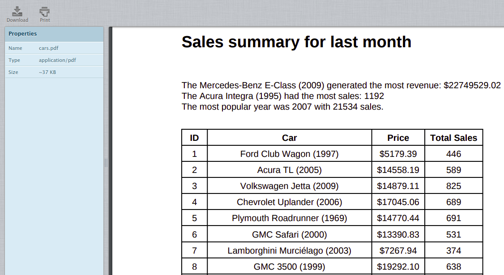

# Project Problem Statement
It's that time again, time to flex your programming muscles and practice solving a real-life problem with the skills you acquired!

In the next lab, you'll have to process information related to the sales your company generated last month, and turn that into a nicely formatted PDF report that you'll then send by email so that your boss can look at it. The lab machine has email configured so that you can check your resulting emails through a nice webmail interface that's already up and running.

The system that you'll work with already includes some scripts that will do part of the work for you. You'll need to put these pieces together to get the result you want, basing your code on the one that's already there.

As we called out before, solving these problems can take some time, and that's ok! Solving complex problems is the best way to really master your coding skills. Before you start the lab, make sure you understand what you need to do and that you know how you want to solve it. Nobody is rushing you, so take as much time as you need, review any concepts that are not totally clear, and then get to it.

Good luck, you can totally do this!

## Sample report
In this section, you will be creating a PDF report named "A Complete Inventory of My Fruit". The script to generate this report and send it by email is already pre-done. You can have a look at the script in the scripts/ directory.

In the scripts/ directory, you will find reports.py and emails.py files. These files are used to generate PDF files and send emails respectively.

# Generate report

Now, let's make a couple of changes in the example.py file to add a new fruit and change the sender followed by granting editor permission. Open example.py file using the following command:
    
    nano ~/scripts/example.py

And update the following variables:

|variable_name |value |
|---------------|-------|
|sender|Replace sender@example.com with automation@example.com|
|table_data|Add another entry into the list: ['kiwi', 4, 0.49]|

Now, check the webmail for any new mail. You can click on the Refresh button to refresh your inbox.

## Sales summary

In this section, let's view the summary of last month's sales for all the models offered by the company. This data is in a JSON file named car_sales.json. Let's have a look at it.

To simplify the JSON structure, here is an example of one of the JSON objects among the list.

    {
        "id": 47,
        "car": {
                "car_make": "Lamborghini",
                "car_model": "Murciélago",
                "car_year": 2002
        },
        "price": "$13724.05",
        "total_sales": 149
    }

Here id, car, price and total_sales are the field names (key).

The script cars.py already contains part of the work, but learners need to complete the task by writing the remaining pieces. The script already calculates the car model with the most revenue (price * total_sales) in the process_data method. Learners need to add the following:

1. Calculate the car model which had the most sales by completing the process_data method, and then appending a formatted string to the summary list in the below format:

- "The {car model} had the most sales: {total sales}"

2. Calculate the most popular car_year across all car make/models (in other words, find the total count of cars with the car_year equal to 2005, equal to 2006, etc. and then figure out the most popular year) by completing the process_data method, and append a formatted string to the summary list in the below format:

- "The most popular year was {year} with {total sales in that year} sales."

## The challenge
Here, you are going to update the script cars.py. You will be using the above JSON data to process information. A part of the script is already done for you, where it calculates the car model with the most revenue (price * total_sales). You should now fulfil the following objectives with the script:

1. Calculate the car model which had the most sales.
- Call format_car method for the car model.

2. Calculate the most popular car_year across all car make/models.
Hint: Find the total count of cars with the car_year equal to 2005, equal to 2006, etc. and then figure out the most popular year.

The code is well commented including the TODO sections for you to understand and fulfill the objectives.

## Generate PDF and send Email
Once the data is collected, you will also need to further update the script to generate a PDF report and automatically send it through email.

To generate a PDF:

- Use the reports.generate() function within the main function.

- The report should be named as cars.pdf, and placed in the folder /tmp/.

- The PDF should contain:

    - A summary paragraph which contains the most sales/most revenue/most popular year values worked out in the previous step.

Note: To add line breaks in the PDF, use: \  between the lines.
    
- A table which contains all the information parsed from the JSON file, organised by id_number. The car details should be combined into one column in the form <car_make> <car_model> (<car_year>).

Note: You can use the cars_dict_to_table function for the above task.

Example:

|ID|Car|Price|Total_Sales|
|---|---|---|---|
|47|Acura TL(2007)|€14459,15|1192|
|73|Porsche 911 (2010)|€6057,74|882|
|85|Mercury Sable (2005)|€45660,46|874|

To send the PDF through email:

Once the PDF is generated, you need to send the email, using the emails.generate() and emails.send() methods.

Use the following details to pass the parameters to emails.generate():

- **From:** automation@example.com
- **To:** <user>@example.com
- **Subject line:** Sales summary for last month
- **E-mail Body:** The same summary from the PDF, but using \n between the lines
- **Attachment:** Attach the PDF path i.e. generated in the previous step

Now, check the webmail for any new mail. You can click on the Refresh button to refresh your inbox.

Output:

Open cars.pdf that's located on the right most side.

